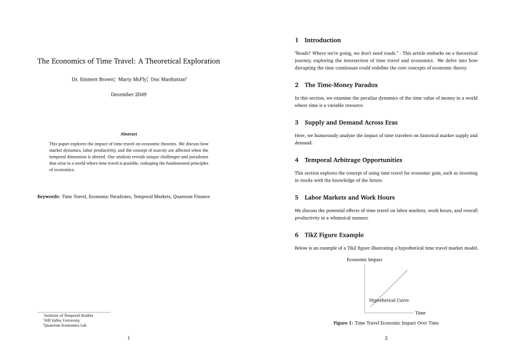

# mies.sty

[](LICENSE)
[](#)
[](https://www.overleaf.com/docs?snip_uri=https://github.com/julianhinz/mies.sty/archive/refs/heads/main.zip)

**mies.sty** is a clean and typographic LaTeX style for academic articles.  
It emphasizes clarity, spacing, and classic design principles — inspired by Mies van der Rohe’s *less is more*.

It comes with two variants:

- `mies.sty` — full-featured style for papers with math, tables, TikZ figures, and longtable support
- `minimies.sty` — minimal variant for short papers or clean drafts

---

## Preview



---

## Usage

1. Copy `mies.sty` (or `minimies.sty`) into your project folder  
2. Start your article like this:

    ```latex
    \documentclass[11pt,a4paper]{article}
    \usepackage{mies} % or \usepackage{minimies}
    ```

3. (Optional) Set PDF metadata:

    ```latex
    \hypersetup{
        pdfauthor = {Your Name},
        pdftitle  = {Your Paper Title},
    }
    ```

---

## Example

See [`paper.tex`](paper.tex) for a fully worked example:  
**“The Economics of Time Travel: A Theoretical Exploration”** — coauthored by Doc Brown, Marty McFly, and Doc Manhattan.

It includes:

- classic article structure (`\section{}`, `\maketitle`, `\abstract`)
- citations via `natbib`
- a TikZ figure and a table
- proper spacing and margins
- PDF metadata
- footnotes that stick to the bottom

To compile:

```bash
latexmk -pdflatex paper.tex
```

---

## Features

- **Layout**
  - `geometry` with generous 1.2 inch margins
  - line spacing set to 1.25
  - no paragraph indentation
  - optional landscape pages via `pdflscape` / `lscape`
- **Math & Tables**
  - `amsmath`, `amssymb`, `bm`, `array`
  - full table support: `longtable`, `threeparttable(x)`, `booktabs`, `tabularx`, `supertabular`
- **Figures**
  - `graphicx`, `caption`, `subcaption`, `float`, `placeins`, `rotating`, `tikz`
- **Typesetting**
  - `charter` font
  - `microtype` for improved text flow
  - `parskip` and `setspace`
- **PDF metadata & links**
  - `hyperref` with black link color
  - clean footnotes via `footmisc`
- **Custom macros**
  - bold math shortcuts like `\fmalpha`, `\fmbeta`, `\fmtau`
  - rotated column headers with `\header`
  - `\tba` placeholder for unfinished sections

---

## Citation

If you’d like to cite the style in your document or article, use:

```bibtex
@misc{mies,
    title = {mies: A LaTeX article theme},
    author = {Hinz, Julian},
    year = {2025},
    note = {\url{https://julianhinz.com/mies}},
}
```

---

## License

MIT
